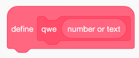
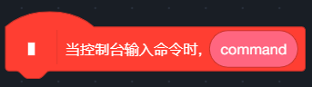
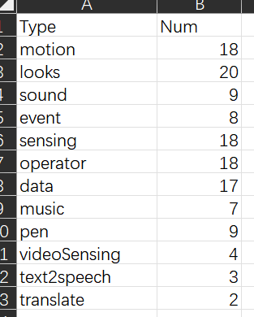

# Devlopers Guide

## Components & Propertities of Scratch Blocks

| term   | type          | meaning                                        |
| ------ | ------------- | ---------------------------------------------- |
| block  | class         | an element in list `project.json`/`blocks`     |
| struct | str (limited) | the role a `block` plays in Scratch            |
| entity | bool          | true if the block is visible in Scratch editor |

### struct

The following marks are used in this part.

CCW： CCW specified
Ent： entity
NEnt： non-entity

#### entity struct
- unknown 未知积木

- top-input [CCW] 内含填空的顶层块

  
  

- top-def 函数定义
  
  

图中的 define 部分，其 json 文件`input`部分含有`prototype`

- top-arg 内含形参的顶层块



- top 无形参无填空顶层


- special-var 变量或列表参数

没有block实现，在input中出现

- special-num 形参/实参

有block实现，包含普通Scratch函数的数字型形参和实参，以及CCW中提供的特殊实参和形参

- special-bool 形参/实参

有block实现，包含普通Scratch函数的布尔型形参和实参，以及CCW中提供的特殊实参和形参

- sentence 语句

- num 参数

- bool 布尔值

- cmouth 控制语句，携带列表 cmouth，内容为 input 属性

#### non-entity struct
- special-menu 作为积木的列表
- prototype 内含形参的 non-entity
- menu 菜单


---
- Para: 一个代码段
- Category: 人为区分的积木类型（与前缀不一定相同）
- id：project.json 中随机生成的一个标识符
- info：各 opcode 对应的信息

```js
{
    "motion_movesteps": {
        "pf": [
            "sc"
        ],
        "struc": "sentence"
    },
    "motion_turnright": {
        "pf": [
            "sc"
        ],
        "struc": "sentence"
    },
    "motion_turnleft": {
        "pf": [
            "sc"
        ],
        "struc": "sentence"
    }
}
```

### project.json

- input

  ```json
  "inputs": {
    "BACKDROP": [
      3,
      [
        12,
        "1",
        "dJ*BpT[EaE/~RhqUMm7O"
      ],
    "WU/HnVSoORyWXyHv%$*U"
    ]

    "SOUND_MENU": [
      1,
      "/uL^2][e5W/4T8jcz7IG"
    ]
  }
  ```


## Block Object
原生情况
